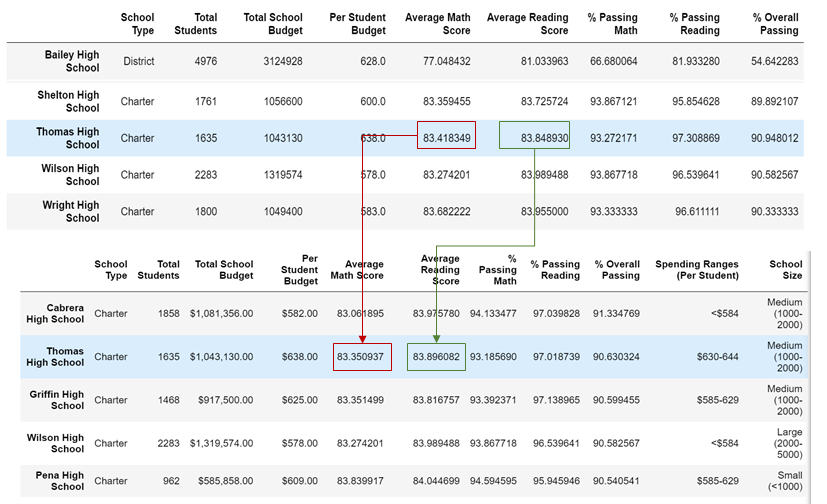

# School District Analysis
### [Module 4] PyCitySchools Challenge

## Overview
We were given the task to analyze student grades from different high schools. For this challenge, our goal was to find and replace the incorrect math and reading scores for Thomas High School 9th graders while keeping the rest of the data integrity.

* Many Correlations were conducted, although the mechanism for causality is not in the scope of this project. As part of this analysis, we removed certain data that appeared to be academic dishonesty. This created variance from the data pre-removal.

## Results

* District level effect of removing potentially dishonest scores on Thomas High School: The move average, from Math scores of 83.42 to 83.35 and reading scores move from 83.85 to 83.89. This removal decreases the district level scores.
* The school summary ends with a non-applicable value for the 9th-grade class, given the doubts raised by the school board. 
* When the 9th-grade scores from THS are removed, we see a percent passing rate that is slightly lower. Without removing this data, THS students passed math at a rate of 93.27% and reading at 97.31%. With this filter, the passing rates are 97% for reading, and 93.19% for math. 
* The effect of these score changes is minimal across the data set.
* By grade, Thomas High School has no results for 9th grade, but the rest of its scores are unaffected.
* Spending by the school is unaffected when averaging out across schools. Any effect in by school size is similarly lost in averages and rounding, and similar with overall results by school type.

## Summary
Once the results have been modified to control for potential academic dishonesty, we lost any data for the 9th grade at Thomas High School. The average scores for the district were not strongly shifted, but it decreases district-level scores slightly. 

This analysis shifts entirely future models and expectations for the 9th-grade class since these scores are not accurate. The potential academic dishonesty reduces confidence in the administration and future scoring of Thomas High School. 
